Distributed Message Queue
================================

* Hi. And welcome to the system design interview channel. Today we design a distributed message queue. First, let’s make sure we are on the same page regarding the problem statement. What is a distributed message queue? Let's say there are two web-services called producer and consumer, and they need to communicate with each other. One option is to setup a synchronous communication, when producer makes a call to a consumer and waits for a response. This approach has its own pros and cons. Synchronous communication is easier and faster to implement.

* At the same time synchronous communication makes it harder to deal with consumer service failures. We need to think when and how to properly retry failed requests, how not to overwhelm consumer service with too many requests and how to deal with a slow consumer service host. Another option is to introduce a new component that helps to setup asynchronous communication. Producer sends data to that component and exactly one consumer gets this data a short time after. Such component is called a queue.

* And it is distributed, because data is stored across several machines. Please do not confuse queue with a topic. In case of a topic, message that is published goes to each and every subscriber. In case of a queue, message is received by one and only one consumer. And as it often happens with interview questions, the statement is ambiguous. What are the functional requirements? What non-functional requirements have a priority over others? What is a scale we need to deal with? All these questions need to be clarified with the interviewer.

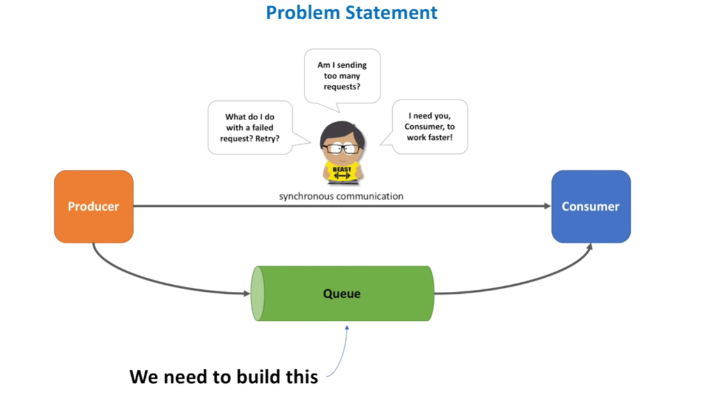

Functional Requirements
==================================

* Let's do our best and define requirements ourselves. Starting with functional requirements. At this stage of the interview it may be hard to come up with a definitive set of requirements. And it’s usually not needed. Time limit allows us to only focus on several core APIs, like send message and receive message. As for non-functional requirements, we want our system to be scalable and handle load increase, highly available and tolerate hardware and network failures, highly performant, so that both send and receive operations are fast, and durable, so that data is persisted
* once submitted to the queue. And of course, there may be many other requirements either explicitly stated by the interviewer or intentionally omitted. Among functional requirements, we can be asked to support create and delete queue APIs, or delete message API. There may be specific requirements for the producer (for example system needs to avoid duplicate submissions), or security requirements, or an ask to implement a specific ordering guarantee. As for non-functional requirements, the interviewer may define specific service level agreement
* numbers (so called SLA, for example minimum throughput our system needs to support), or requirements around cost-effectiveness (for example system needs to minimize hardware cost or operational support cost). But do not worry if you can’t think of all the possible requirements. Interviewer is your friend and will help to scope the problem. You just need to be proactive and outline main use cases. Now let’s start drafting the architecture. Let’s start with components that are common for many distributed systems.

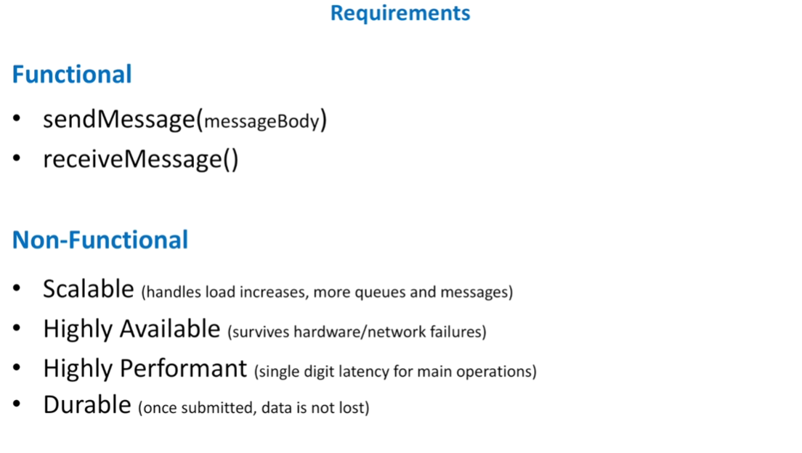

* First, we need a virtual IP. VIP refers to the symbolic hostname (for example myWebService.domain.com) that resolves to a load balancer system. So next, we have a load balancer. A load balancer is a device that routs client requests across a number of servers. Next, we have a FrontEnd web service. A component responsible for initial request processing, like validation, authentication, etc. Queue metadata information like its name, creation date and time, owner and any other configuration settings will be stored in a database.
* And best practices dictate that databases should be hidden behind some facade, a dedicated web service responsible for handling calls to a database. And we need a place to store queue messages. So, lets introduce a backend web service, that will be responsible for message persistence and processing. Now, let’s take a look at each component one by one. Load balancing is a big topic. And unless interviewer encourages you to dive deep into load balancing topic, we better not deviate too much from the main question of the interview.

* Always try to stay focused on what really matters. Internals of how load balancers work may not matter, but in order to make sure non-functional requirements to the system we build are fully met, we need to explain how load balancers will help us achieve high throughput and availability. When domain name is hit, request is transferred to one of the VIPs registered in DNS for our domain name. VIP is resolved to a load balancer device, which has a knowledge of FrontEnd hosts. By looking at this architecture, several questions have probably popped in your head?

High Level Architecture
================================

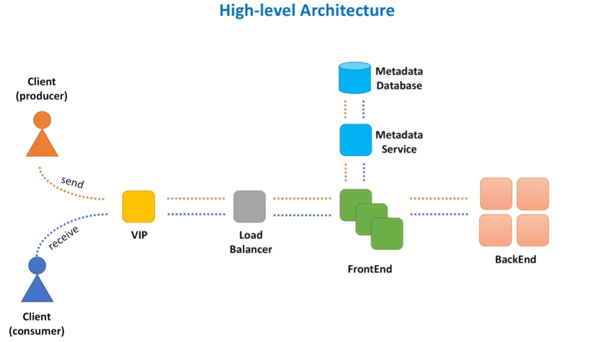

VIP and Load Balancer
====================================

* First, load balancer seems like a single point of failure. What happens if load balancer device goes down? Second, load balancers have limits with regards to number of requests they can process and number of bytes they can transfer. What happens when our distributed message queue service becomes so popular that load balancer limits are reached? To address high availability concerns, load balancers utilize a concept of primary and secondary nodes. The primary node accepts connections and serves requests while the secondary node monitors
* the primary. If, for any reason, the primary node is unable to accept connections, the secondary node takes over. As for scalability concerns, a concept of multiple VIPs (sometimes referred as VIP partitioning) can be utilized. In DNS we assign multiple A records to the same DNS name for the service. As a result, requests are partitioned across several load balancers. And by spreading load balancers across several data centers, we improve both availability and performance. Let's move on to the next component, which is a FrontEnd web service.
* FrontEnd is a lightweight web service, consisting of stateless machines located across several data centers. FrontEnd service is responsible for: request validation, authentication and authorization, SSL termination, server-side data encryption, caching, rate limiting (also known as throttling), request dispatching, request deduplication, usage data collection. Let’s discuss some basics of these features. Request validation helps to ensure that all the required parameters are present in the request and values of these parameters honor constraints.

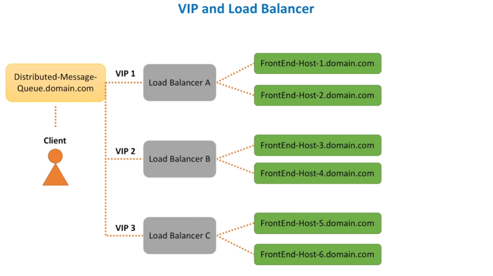

Frontend Web Service
==========================

* FrontEnd is a lightweight web service, consisting of stateless machines located across several data centers. FrontEnd service is responsible for: request validation, authentication and authorization, SSL termination, server-side data encryption, caching, rate limiting (also known as throttling), request dispatching, request deduplication, usage data collection. Let’s discuss some basics of these features. Request validation helps to ensure that all the required parameters are present in the request and values of these parameters honor constraints.

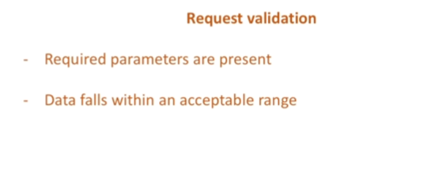

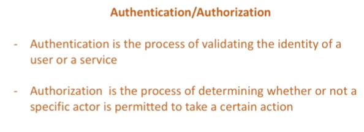

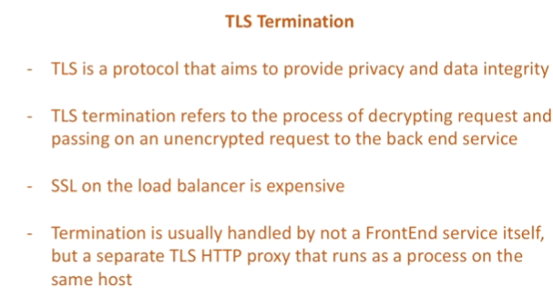

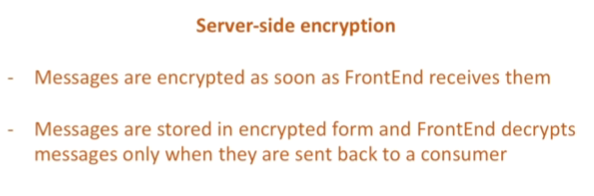

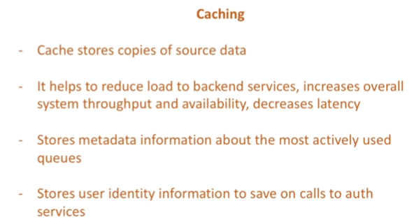

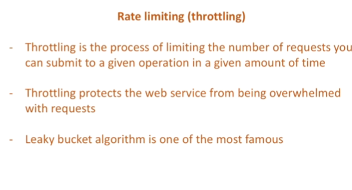

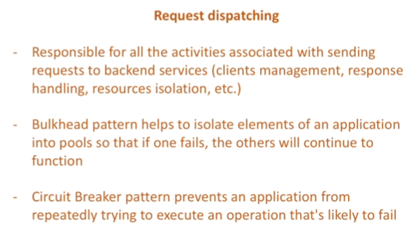

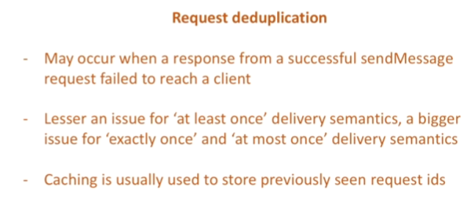

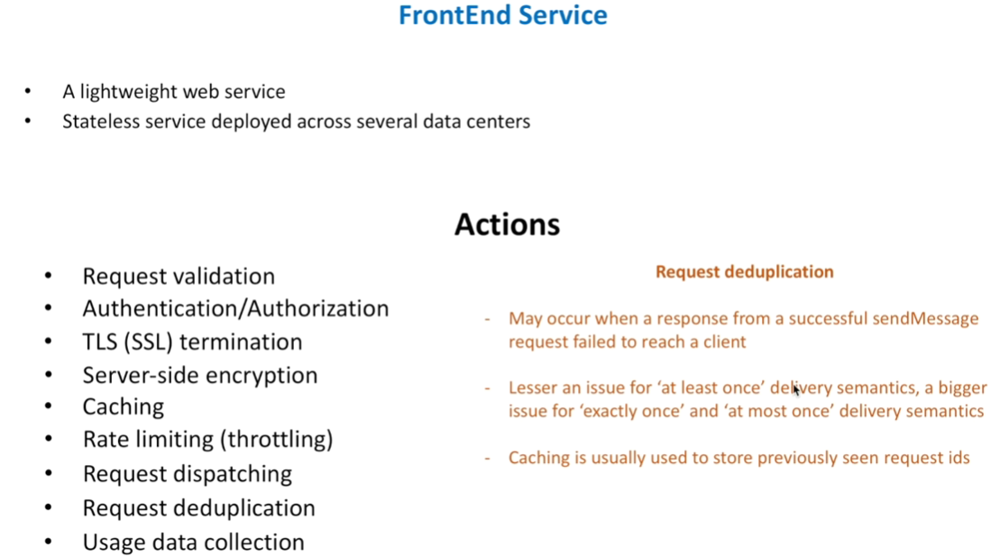

Metadata Service
==========================

* And even though FrontEnd service has many responsibilities, the rule of thumb is to keep it as simple as possible. Moving on to the next component, which is Metadata service. Metadata service stores information about queues. Every time queue is created, we store information about it in the database. Conceptually, Metadata service is a caching layer between the FrontEnd and a persistent storage. It handles many reads and a relatively small number of writes. As we read every time message arrives and write only when new queue is created.

* Even though strongly consistent storage is preferred to avoid potential concurrent updates, it is not strictly required. Lets take a look at different approaches of organizing cache clusters. The first option is when cache is relatively small and we can store the whole data set on every cluster node. FrontEnd host calls a randomly chosen Metadata service host, because all the cache cluster nodes contain the same information. Second approach is to partition data into small chunks, called shards.

* Because data set is too big and cannot be placed into a memory of a single host. So, we store each such chunk of data on a separate node in a cluster. FrontEnd then knows which shard stores the data and calls the shard directly. And the third option is similar to the second one. We also partition data into shards, but FrontEnd does not know on what shard data is stored. So, FrontEnd calls a random Metadata service host and host itself knows where to forward the request to. In option one, we can introduce a load balancer between FrontEnd and Metadata service.

* As all Metadata service hosts are equal and FrontEnd does not care which Metadata host handles the request. In option two and three, Metadata hosts represent a consistent hashing ring. Do not worry if this term is completely new to you. Distributed cache topic is big and we will have a separate video on how to design a distributed cache. Components we built so far were relatively straightforward. Not easy of course, but if you have understanding of several core design principles, you will at least progress thus far in the interview.

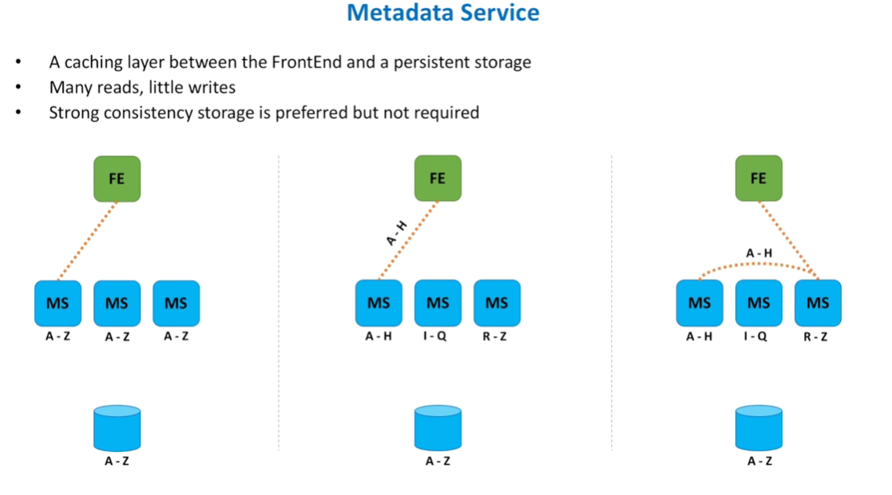