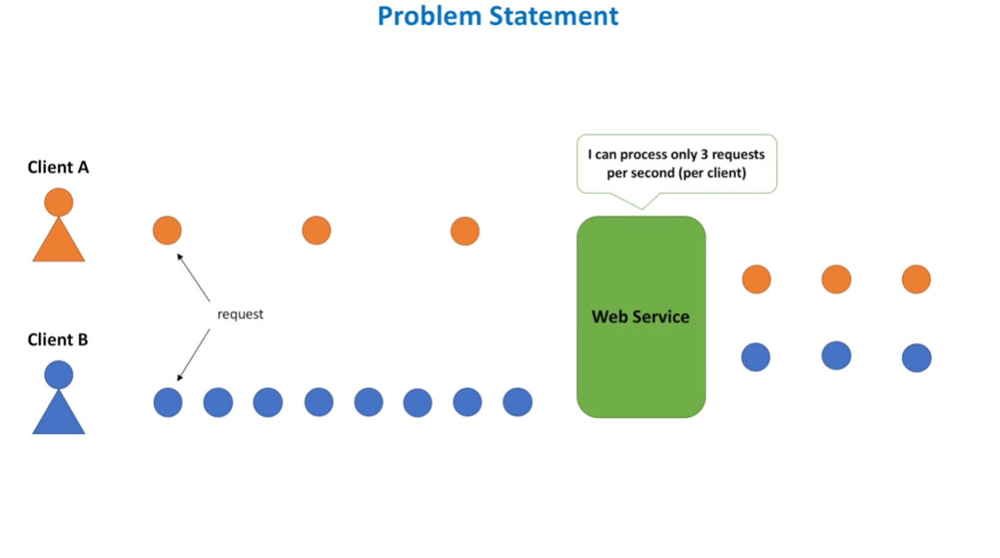
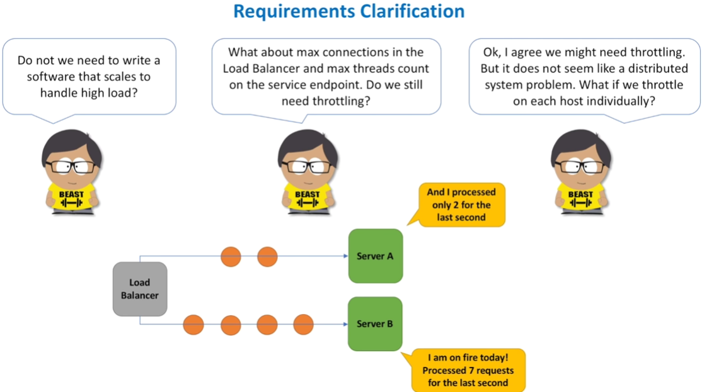
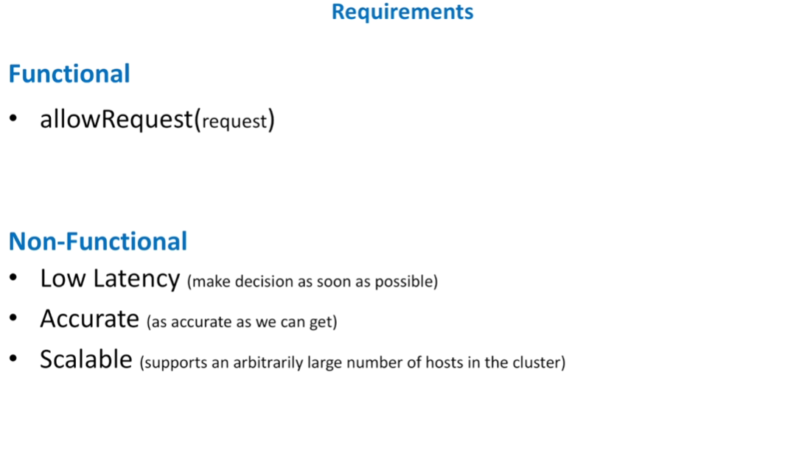

Design Rate Limiter
==============================

* Hi. And welcome to the system design interview channel. Today we design a rate limiting solution, a popular interview question. This may not be obvious, but almost all well-known public services use rate limiting for their APIs: Youtube, Facebook, Twitter, Instagram, cloud services, you name it. And as usual, let’s start with the problem statement. Let’s imaging we launched a web application. And the application became highly popular. Meaning that thousands of clients send thousands of requests every second to the front-end

Problem Statement
================================

* web service of our application. Everything works well. Until suddenly one or several clients started to send much more requests than they did previously. And this may happen due to a various of reasons. For example, our client is another popular web service and it experienced a sudden traffic spike. Or developers of that web service started to run a load test. Or this is just a malicious client who tried to DDoS our service. All these situations may lead to a so called “noisy neighbor problem”, when one client

* utilizes too much shared resources on a service host, like CPU, memory, disk or network I/O. And because of this, other clients of our application start to experience higher latency for their requests, or higher rate of failed requests. One of the ways to solve a “noisy neighbor problem” is to introduce a rate limiting (also known as throttling). Throttling helps to limit the number of requests a client can submit in a given amount of time. Requests submitted over the limit are either immediately rejected or their processing is

* delayed. If this is the first time you hear about rate limiting concept, you might already have several questions to me. Let’s pretend I am your interviewer. And here are some of the things you might want to clarify with me. Ok, the first question I hear from you is that this problem does not have a lot of sense. It should be solved by scaling out the cluster of hosts that run our web service. And ideally, by some kind of auto-scaling, right? Glad you asked. And the problem with scaling up or scaling out is that it is not happening immediately.

Requirements Clarification
=================================

* delayed. If this is the first time you hear about rate limiting concept, you might already have several questions to me. Let’s pretend I am your interviewer. And here are some of the things you might want to clarify with me. Ok, the first question I hear from you is that this problem does not have a lot of sense. It should be solved by scaling out the cluster of hosts that run our web service. And ideally, by some kind of auto-scaling, right? Glad you asked. And the problem with scaling up or scaling out is that it is not happening immediately.

* Even autoscaling takes time. And by the time scaling process completes it may already be late. Our service may already crash. Looks like I still have not convinced you. And the next question I hear from you is about other means of how rate limiting can be achieved. Specifically, you mention load balancers and their ability to limit a number of simultaneous requests that load balancer sends to each application server. Load balancers indeed may prevent too many requests to be forwarded to an application

* server. Load balancer will either reject any request over the limit or send the request to a queue, so that it can be processed later. But the problem with this mechanism - it is indiscriminate. What do I mean by this? Let’s say our web service exposes several different operations. Some of them are fast operations, they take little time to complete. But some operations are slow and heavy and each request may take a lot of processing power. Load balancer does not have knowledge about a cost of each operation.

* And if we want to limit number of requests for a particular operation, we can do this on application server only, not at a load balancer level. Ok, looks like I was able to convince you that “noisy neighbor problem” is a real problem and throttling helps to make web services more resilient. And I think you already have some ideas how to solve it. But one question is still sitting in your head. The problem does not seem to be a system design problem. Algorithmic problem? Yes, as we need to define data structures and algorithm to count how many requests client

* has made so far. Object-oriented design problem? Probably, as we may need to design a set of classes to manage throttling rules. Rules define an allowed throttling limit for each operation. So, if we implement throttling for a single host, are we done? In an ideal world - yes. But not in the real world. Your thought process is very reasonable. If we have a load balancer in front of our web service and this load balancer spreads requests evenly across application servers and each request takes the same amount of

* All this leads to a conclusion that we will need a solution where application servers will communicate with each other and share information about how many client requests each one of them processed so far. If after this conversation between me and myself on your behalf you do not consider me crazy, let's move on and formalize requirements. Both functional and non-functional. Functional requirements are simple. For a given request our rate limiting solution should return a boolean value, whether request

* is throttled or not. As for non-functional requirements we need rate limiter to be fast (as it will be called on every request to the service), accurate (as we do not want to throttle customers unless it is absolutely required), and scalable (so that rate limiter scales out together with the service itself). If we need to add more hosts to the web service cluster, this should not be a problem for the rate limiter. What other requirements you can think of? What else the interviewer may be interested in?

* is throttled or not. As for non-functional requirements we need rate limiter to be fast (as it will be called on every request to the service), accurate (as we do not want to throttle customers unless it is absolutely required), and scalable (so that rate limiter scales out together with the service itself). If we need to add more hosts to the web service cluster, this should not be a problem for the rate limiter. What other requirements you can think of? What else the interviewer may be interested in?

* What about high availability and fault tolerance? Two common requirements for many distributed systems. Are they important for a rate limiting solution? Mmm...not so much. If rate limiter cannot make a decision quickly due to any failures, the decision is always not to throttle. And this makes a lot of sense, right? If we do not know whether throttle or not - we do not throttle. Because we may need to introduce rate limiting in many services, the interviewer may ask us to think about ease of integration.

