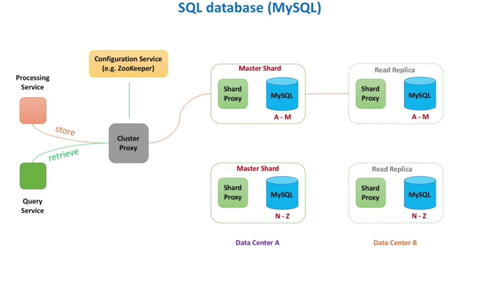
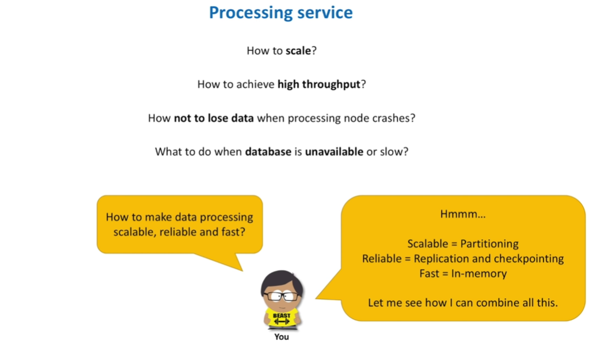
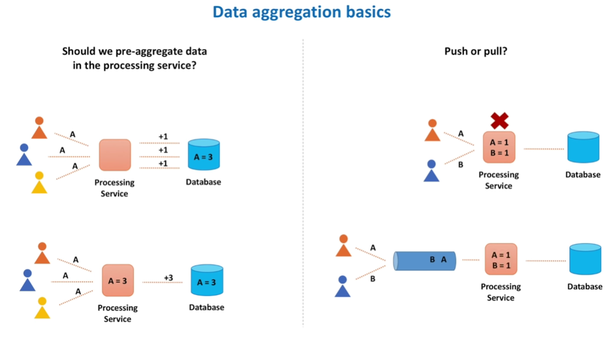
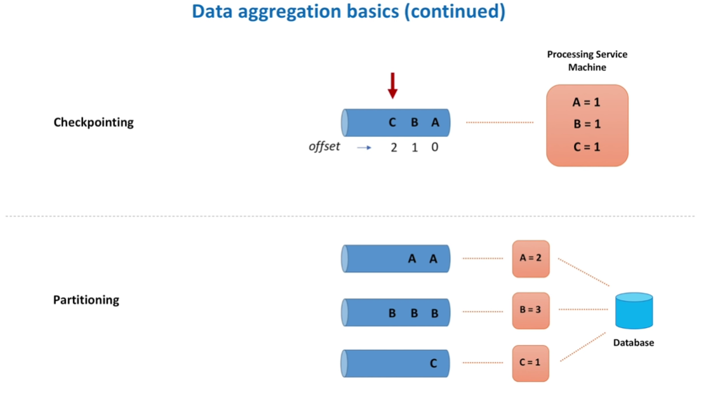
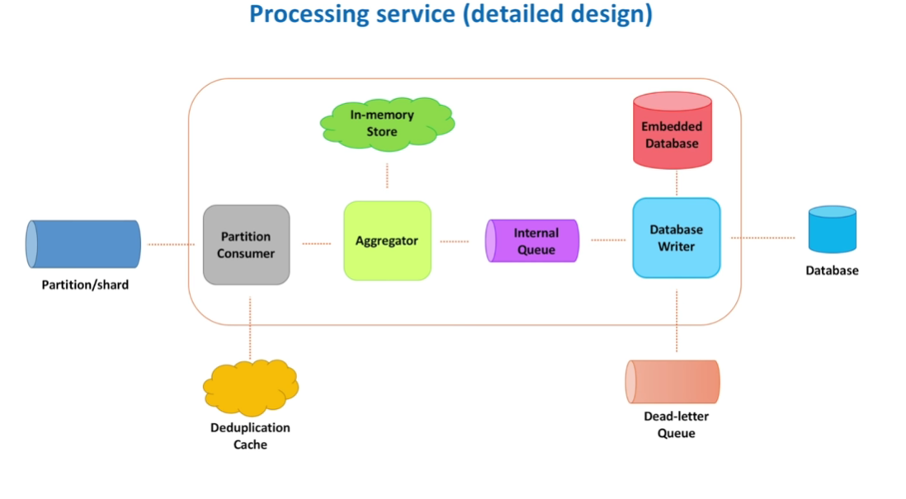

Count videos/likes on instagram

Calculate application performance metrics

Why requirement clarification is so important ?

Count Views on You-tube

SQL/No-SQL
Batch Streaming

Requirement Clarification

* Users -  who will use the system , how it will be used
* Scale (Read and Write) - How many read queries per second , how much data queried per request , How many videos are processed per second, spikes in traffic ?
* Performance - what is expected write to read delay , expected p99 latency
* Cost - Should cost be minimized to develop system , maintain system ?

Functional Requirements

1. System has to count video view events

countViewEvent(videoId)
countEvent(videoId,eventType)
processEvent(videoId,eventType Function)
processEvents(events)
getViewsCount(videoId,startTime,endTime)

Non-Functional Requirements
=============================

1. Scalable 10000/views per second
2. Highly Performant - few ms to return the data
3. Highly Available - highly available all the time
4. Consistency

High Level Architecture
==============================

What we store ?

Video ID

TimeStamp

Store Individual Data
Store Aggregate Data

1. Stream Data Processing
2. Batch Data Processing

Where we store ?
================

SQL Database - MySQL
Split Data into partitions - Sharding 

Make services talk to Database using cluster proxy

How cluster proxy will know healthy and unhealthy instances ?

Configuration service (Zookeeper)

Benefits of Shard Proxy

1. Cache Query Results
2. Publish Metrics
3. Terminate Queries that take too long to return the data
4. Monitor Data Base Instance Health

We need to replicate data. Let's call each existing shard a master shard or a leader. And for every master shard we introduce a copy of it, called read replica or a follower. We call it read replica because writes still go through a master shard, but reads may go through both master shard and a replica. We also put some replicas to a data center different from their master shard. So that if the whole data center goes down, we still have a copy of data available. So, when store data request comes, based on the information provided by Configuration

NO SQL Data Base (Cassandra)
============================

`We have all these proxies, configuration service, leader and replica instances. May be we can simplify things a little bit. Let's take a look at what NoSQL databases can offer us. And more specifically, Apache Cassandra database. In NoSQL world we also split data into chunks - shards, also known as nodes. But instead of having leaders and followers we say that each shard is equal. We no longer need configuration service to monitor health of each shard. Instead, let's allow shards talk to each other and exchange information about their state.`

To reduce network load, we do not need each shard to talk to every other shard. Every second shard may exchange information with a few other shards, no more than 3. Quickly enough state information about every node propagates throughout the cluster. This procedure is called a gossip protocol. Ok, each node in the cluster knows about other nodes. And this is a big deal. Remember that previously we used Cluster Proxy component to route requests to a particular shard. As Cluster Proxy was the only one who knew about all shards.

But now every node knows about each other. So, clients of our database no longer need to call a special component for routing requests. Clients may call any node in the cluster and node itself will decide where to forward this request further. Let's elaborate on this. Processing service makes a call to store views count for some video B. And let's say node 4 is selected to serve this request. We can use a simple round robin algorithm to chose this initial node, or we may be smarter and chose a node that is "closest" to the client in terms of network distance.

Let's call this node 4 a coordinator node. The coordinator node needs to decide which node stores data for the requested video. We can use consistent hashing algorithm to pick the node. As you may see node 1 should store the data for the video B. Coordinator node will make a call to the node 1 and wait for the response. Actually, nothing stops coordinator node to call multiple nodes to replicate data, for example 3 nodes if we want 3 copies of data. Waiting for 3 responses from replicas may be too slow, so we may consider the write.

to be successful as soon as only 2 replication requests succeeded. This approach is called quorum writes. Similar to quorum writes, there is a quorum reads approach. When Query service retrieves views count for video B, coordinator node 4 will initiate several read requests in parallel. In theory, the coordinator node may get different responses from replica nodes. Why? Because some node could have been unavailable when write request happened. That node has stale data right now, other 2 nodes has up-to-date data.

Remember that when we defined non-functional requirements we chose availability over consistency? It simply means we prefer to show stale data than no data at all. Let me clarify this. Synchronous data replication is slow, we usually replicate data asynchronously. In case of a leader-follower replication for example, some read replicas may be behind their master. Which leads to a situation when different users see different total count for a video. This inconsistency is temporary, over time all writes will propagate to replicas.

This effect is known as eventual consistency. Cassandra actually extends the concept of eventual consistency by offering tunable consistency. Let's discuss this big topic separately and in more details. After discussing what we store and where, let's think how we can store the data. There is a big difference how we do data modeling for SQL and NoSQL databases. When designing data models for relational databases we usually start with defining nouns in the system. We then convert these nouns into tables and use foreign keys to reference related data

>in these tables. Let's take a look at the example. We want to build a report that shows the following three entities: information about video, number of total views per hour for last several hours and information about the channel this video belongs to. We pass video identifier as input for this report. In a relational database we would define the following three tables: video info table that contains information about videos, video stats table that contains total views accumulated for each hour and channel info table that stores information about video channels.

And to generate report mentioned above, we run a JOIN query that retrieves data from all three tables. And important property of a relational database - data is normalized. It simply means we minimize data duplication across different tables. For example we store video names in the video info table only. And we do not store video names in other tables. Because if some video name changes, we have to change it in several places in the database. Which may lead to inconsistent data. So, normalization is good for relational databases.

How we store ?
=================

>But NoSQL databases promote a different paradigm. They say that we no longer think in terms of nouns, but in terms of queries that will be executed in the system we design. And denormalization is perfectly normal. Not something that we always have to do, but something that we should not be afraid of. In Cassandra for example, report mentioned above will be logically represented as shown in the table. We store everything required for the report together. And instead of adding rows, as in a relational database, we keep adding columns for every

next hour. Great, we have covered the storage portion of our design. And hopefully by now you have got the idea that both SQL and NoSQL database can be used for our solution. What database would you chose? Please let me know in the comments. I also would like to clarify one thing. As you know there are 4 types of NoSQL databases: column, document, key-value and graph. So far we have used Cassandra as a representative of NoSQL databases. We chose Cassandra because it is fault-tolerant, scalable (both read and write throughput increases

linearly as new machines are added). It supports multi datacenter replication and works well with time-series data. And of course other options are available as well. For a typical system design interview we usually do not need to know architectures of different databases. But we need to know advantages and disadvantages of those and when to use what. And please do not think that all NoSQL database have architectures similar to the one we discussed earlier. Cassandra is a wide column database that supports asynchronous masterless replication.

But other NoSQL databases have different architectures. For example MongoDB, a documented-oriented database, uses leader-based replication. HBase, which is another column-oriented data store, similar to Cassandra, has a master-based architecture as well. We will talk more about different database design principles on this channel. As well as when to use each particular database type. Ok, enough talking about databases, let's move on to data processing. First, let's define what processing really means.

Processing Service
============================

But other NoSQL databases have different architectures. For example MongoDB, a documented-oriented database, uses leader-based replication. HBase, which is another column-oriented data store, similar to Cassandra, has a master-based architecture as well. We will talk more about different database design principles on this channel. As well as when to use each particular database type. Ok, enough talking about databases, let's move on to data processing. First, let's define what processing really means.

When Youtube users open some video, we want total views count for this video to be displayed immediately. It means we need to calculate view counts on the fly, in real-time. Also, when video owner opens statistics for the video we want to show per hour counts. So, processing basically means we get a video view event and increment several counters: total and per hour counters. You are in front of the whiteboard, interviewer is looking at you, ready to capture your next ideas. Where to start? As usual start with requirements.

Remember, we wrote them down on the whiteboard before? We want the processing service to scale together with increase in video views. We want to process events quickly. And we do not want to lose data either when some processing service machine crashes or when database becomes unavailable. So, we literally ask ourselves how to make events processing scalable, reliable and fast. And this is another example of why knowledge and preparation are crucial for system design interviews. Because curiosity and study will equip you with blueprints you can apply for various

system designs. Even if you never solved such problems in the past. For example you know already that when we want to scale data processing we should think about partitioning. When we want to avoid data loss we replicate data. And when speed matters we should keep things in memory and minimize disk reads. Easy, right? But before diving into processing service detailed design, let's make sure we all agree on some basics. The first question I have for you is whether or not we should pre-aggregate data in the
processing service. Let me clarify the question. We have two options how to update counters in the database. In the first option the processing service increments counter for every incoming event. Meaning that if three users opened the same video A, the processing service simply increments total count in the database three times. Logic is simple, event comes and we increment the counter. In the second option, we accumulate data in the processing service memory for some period of time, lets say several seconds.

And add accumulated value to the database counter. For example three users opened some video A, the processing service takes each event and increments in-memory counter. And every several seconds in-memory counter value is sent to the database to calculate the final count. I claim that the second option is better (for large scale systems of course). Someone who agrees with me, please help me prove it. By sharing your arguments in the comments section. Further in this video I assume that we aggregate data in memory.

With this assumption in mind, what do you think is better: push or pull? Where push means that some other service sends events synchronously to the processing service. While pull means that the processing service pulls events from some temporary storage. Although the answer is that both options are totally valid and we can make both work, pull option has more advantages, as it provides a better fault-tolerance support and easier to scale. Let me explain. We have two users opening two different videos A and B. Processing service updates in-memory

counters, returns successful responses back to clients and the machine crashes without sending this data to the database. Data is lost. The alternative to push approach is for the processing service to pull events from a storage. Events generated by users are stored in that temporary storage first. Processing service machine pulls events and updates in-memory counters. And if machine crashes, we still have events in the storage and can re-process them. And here we come to another important concept, called checkpointing.

