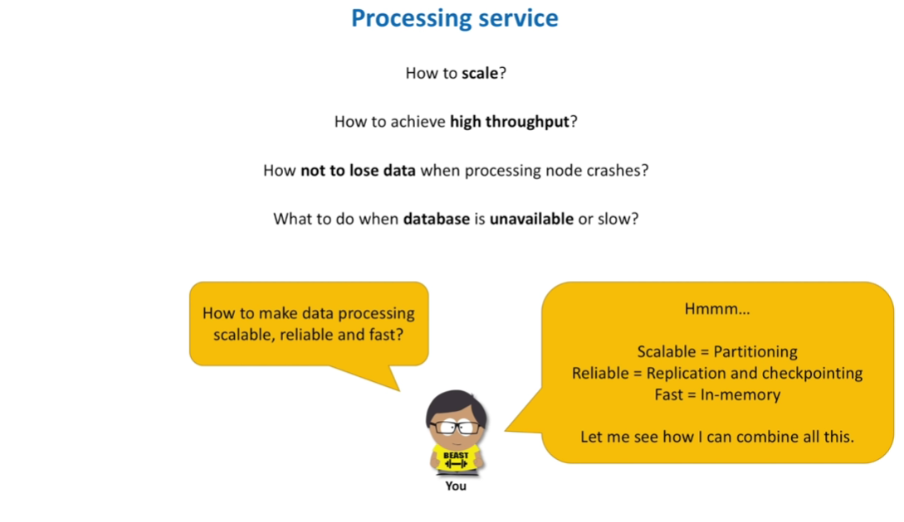

* Hi. What do you think is a single most important component required for a successful system design interview? What should we focus on the most while preparing for one? I bet this is knowledge. Knowledge of system design concepts and how to combine them together. And let me prove you that by walking you through all the stages of a typical system design interview. This is system design interview channel. And today we discuss how to count things at a large scale. So, the interviewer asks us to design a system that does counting.
* The problem may be articulated clearly, for example we need to count views for videos on Youtube. Or likes on Instagram or Facebook. But more often than that, the problem will be stated in a vague or a more general manner. For example, we may be asked to calculate not a single metric, like number of views, but a set of metrics. For example we need to monitor performance of different applications. Which means we need to count how many requests go through the service, how many errors service produce, average response time.

* And of course nothing stops the interviewer from stating the problem in a very generic form, like analyze data in real-time. What does data analysis mean? Who sends us data? Who uses results of this analysis? What real-time really means? These and many other questions need to be clarified. And even if system design problem seems clear to you, let me give you two big reasons why you still need to ask your interviewer questions. The first reason is really important for the interviewer. The second reason is important for you.
* The interviewer wants to see how you deal with ambiguity. Whether you can identify key pieces of the system and define a scope of the problem. And why it is so important for the interviewer - because she wants to understand how you will approach design problems in real life. System design interview problems are usually open-ended. It is impossible to solve such problems within 45 or 60 minutes interview. We should be clear on what functional pieces of the problem we are going to focus till the rest of the interview.
* And why requirements clarification is so important for us, interviewees? Mainly because there may be many solutions to the problem asked. And only when we fully understand what features of the system we need to design, we can come up with a proper set of technologies and building blocks. For example, let's take a problem of counting Youtube video views. If you ask this problem a software engineer with experience in SQL databases, he will explain you why MySQL database is a good fit. Engineer with profound experience in NoSQL databases will explain how to count things
* at large scale using for example Apache Cassandra database. We may use distributed cache to count stuff. Or apply stream processing techniques. Experts in cloud computing will solve this problem using public cloud services only. Engineers focusing on batch processing will solve this problem using for example Hadoop MapReduce. And views counting problem can indeed be solved using all these different approaches. But these options are not equal. Each has its own pros and cons. We should pick those options that address requirements.

Requirement Clarification
=========================

What we may want to ask about? My recommendation is to focus on the following 4 big categories: Users, where we want to understand who and how will use the system. Scale, where we want to understand how our system will handle a growing amount of data. Performance, where we want to know how fast our system must be. And cost, where we need to understand budget constraints. Let's see what specific questions in each category we may ask. Here and below we imply views counting system as an example. Who will use the system?

Is this all Youtube viewers who will see the total views count for a video? Or this is a per-hour statistics available to a video owner only? Or may be this total count will be used by some machine learning models to generate recommendations. How the system will be used? The data may be used by marketing department only to generate some monthly reports. In other words data is retrieved not often. Or data is sent to recommendation service in real-time. Meaning that data may be retrieved from the system with a very high pace.

Questions in this category help us understand what data we store in the system. Questions in the Scale category should give us a clue how much data is coming to the system and how much data is retrieved from the system. So, the questions we should ask: How many read queries per second the system needs to process. How much data is queried per request. How many video views per second are processed by the system. Should we deal with sudden traffic spikes and how big they may be. The interviewer will help us define these numbers.

Or we may assume some reasonable values. Questions in the performance category should help us quickly evaluate different design options. For example, if we can count views several hours later than these views actually happened, both batch data processing and stream processing design options can be considered. But if time matters and we need to count views on the fly, or in other words in real-time, batch data processing is not an option. It is just too slow. Another good question to ask, is to clarify how fast data must be retrieved from the system.

* And if interviewer tells us that response time must be as small as possible, it's a hint that we must count views when we write data and we should do minimal or no counting when we read data. In other words data must already be aggregated. And questions in the cost category should help us evaluate technology stack. For example, if asked to minimize development cost, we should be leaning towards well-regarded open-source frameworks. And if future maintenance cost is a primary concern, we should consider public cloud services
* for our design. Here is a little secret you might already know. During requirements clarification interviewer starts to understand your level of expertise in systems design. As with coding interviews, if you do not ask questions, this is a warning sign for the interviewer. And here is my advice: think along 4 categories mentioned here, think about data - what data, how it gets in and gets out of the system, and do not worry about time too much. You better spend additional 5 minutes clarifying requirements and scope than find yourself
* solving a different or more complex problem than the interviewer actually asked. The end goal of requirements clarification discussions is to get us closer to defining both functional and non-functional requirements. When we say functional requirements, we mean system behavior, or more specifically APIs - a set of operations the system will support. This is what our system will do. And when we say non-functional requirements, we mean system qualities, such as fast, fault-tolerant, secure. This is basically how a system is supposed to be.
* Let's define functional requirements first. And here is my practical advice. After figuring out what the system should do, you write it down on the whiteboard. In a few sentences. For example, we write down that the system has to count video view events. Count view events is the actual action the system performs and video becomes the input parameter. And if we want the system to calculate not just views, but a broader set of events, let's say likes and shares, we may generalize our API a bit and introduce event type parameter.
* This parameter indicates type of the event we process. We can go one step further and make the system calculate not only count function, but other functions as well, like sum and average. By supporting sum function we can calculate such metric as "total watch time" for a video. While average function can help us calculate average view duration. And we can even further generalize the API and say that the system will not just process events one by one, but a list of events as a single batch. Where each event is an object that contains information about a video, type of the event,
* time when event happened and so forth. Similar thought process can be applied for data retrieval API. We first write down something like: the system has to return video views count for a time period. Get views count becomes an action. While video identifier and start and end time become input parameters. If we want to retrieve count not only for video views, but for likes and dislikes for example, we can introduce event type parameter. And if we want our API return not just count statistics, but also statistics for sum and
* average, we should specify function as a parameter and name our API in a more generic way, like getStats. Following this simple technique will help you identify names of APIs, input parameters and, if needed, make several iterations to generalize APIs. Now, let's talk about non-functional requirements. Usually, the interviewer will not tell us specific non-functional requirements. Most likely, she will challenge us with mentioning big scale and high performance, as it is hard to achieve both at the same time.
* And we will need to find tradeoffs. In one of the previous videos I recommended to focus on scalability, performance and availability as top priority requirements. Let's use them here. We need to design a system that should handle tens of thousands of requests per second. We also want view count statistic to be returned in a matter of few tens of milliseconds. And we want view count statistics to be shown to users all the time. Even when there are network or hardware failures in the system. Although these 3 will be our primary concern, let's also talk about two other interesting

* requirements. Let's recall a CAP theorem and talk about consistency a bit. And I would like us to touch a cost minimization topic. And my advice is that you write down non-functional requirements on the whiteboard as well. It will help you later while choosing among several design options. We will talk more about this. Now, we have come to the next stage of a system design interview: high-level architecture. And we will start with something really simple. We need a database to store data. We will have a web service that processes incoming video view events and stores data

* in the database. To retrieve view counts from the database, let's introduce another web service. Nothing scary so far, right? And it should not be. At this point we do not yet have a clear vision of all pieces of the design. So, we just throw some very high-level components to the whiteboard. But what do we do next? High chances the interviewer is an expert in the field and knows the question very well. And she may start asking questions about any component we outlined in the high-level architecture.
* But we may not feel comfortable discussing any component just yet. Unless you are an expert in this field yourself, the whole picture may not yet be clear to you. This is in our best interest as interviewees to drive the conversation and move forward one step at a time. This is like assembling a puzzle. The interviewer can assemble the puzzle starting from any color group. But we need to start with something simple and construct the frame with the outside pieces first. So, what is this frame of outside pieces of a system design puzzle?
* It's data. And more specifically we need to think what data we want to store and how. Or using more professional terms we need to define a data model. We have two options for what data we want to store. We may store each individual video view event. Or we may calculate views on the fly and store aggregated data. When we store individual events we capture all attributes of the event: video identifier, timestamp, user related information such as country, device type, operating system and so on. When we aggregate data we calculate a total count per some time interval, let's say one

* minute and we lose details of each individual event. There are pros and cons of each option. Individual events can be stored really fast. We just get the event and push it to the database. Later, when we retrieve data, we can slice and dice data however we want. We can filter based on specific attributes, aggregate based on some rules. And if there was a bug in some business report, we can recalculate numbers from scratch. But there are drawbacks of this approach. We cannot read data quickly. We need to count each individual event when total count is requested.
* This takes time. Another big disadvantage of this approach - it may cost a lot of money to store all the raw events. Youtube generates billions of view events per day. Raw events storage must be huge. On the other hand, reads become fast when we aggregate data. We do not need to calculate each individual event, we just retrieve total count value. Another nice property of the aggregated data, we can use it for decision making in real-time. For example, we may send the total count value to a recommendation service or trending service,
* for popular videos to be promoted to trends. Aggregated data approach has drawbacks as well. First of all, we can only query data the way it was aggregated. Ability to filter data or aggregate it differently is very limited. This approach also requires us to implement data aggregation pipeline. We need to somehow pre-aggregate data in memory before storing it in the database. This is not an easy task and later you will see why. Another big problem with this approach, it is hard or even impossible to fix errors.
* Let's say we introduced a bug in the aggregation logic. Then, how do we fix total counts after the bug was fixed? So, which option should we chose? Store raw events or aggregate data in real-time? This is where we need interviewer to help us make a decision. We should ask the interviewer about expected data delay. Time between when event happened and when it was processed. If it should be no more than several minutes - we must aggregate data on the fly. If several hours is ok, then we can store raw events and process them in the background.

* Former approach is also known as stream data processing, while latter is called batch data processing. The interviewer will let us know what option she is interested the most. But because I have no-one to ask...anybody...no...I will pick both options. And by the way combining both approaches makes a lot of sense for many systems out there. We will store raw events, and because there are so many of them, we will store events for several days or weeks only. And then purge old data. And we will also calculate and store numbers in real-time.
* So that statistics is available for users right away. By storing both raw events and aggregated data we get the best of both worlds: fast reads, ability to aggregate data differently and re-calculate statistics if there were bugs or failures on a real-time path. But there is a price to pay for all this flexibility, the system becomes more complex and expensive. Great topic to discuss with the interviewer. Further in this video we will mainly focus on real-time aggregation option. As I find it more educational from the system design perspective.
* Now let's talk about where we store the data. The interviewer wants to know specific database name and why we make this choice. We should know (and do not worry if you do not know, you will know it in details in several minutes) that both SQL and NoSQL databases can scale and perform well. So, we may want to evaluate both options. And here is where we should recall non-functional requirements. Remember that we wrote them down on the whiteboard before, right? What are those? Scalability, performance and availability.

Where we store data ?
===========================

* So, we should evaluate databases against these requirements. And let's add some more requirements along the way. Feel free to use this list for other interview questions and system design in general. Database solution we chose should scale well for both reads and writes. It should be fast and guarantee high availability. We should be able to achieve required level of data consistency. We should understand how to recover data, achieve security, apply future data model changes. We need to pick hardware and evaluate cost of the solution.
* First, let's see how SQL databases handle these requirements. Things are simple when we can store all our data on a single database machine. But when a single machine is not enough, we need to introduce more machines and split data between them. This procedure is called sharding or horizontal partitioning. Each shard stores a subset of all the data. And because we now have several machines, services that talk to the database need to know how many machines exist and which one to pick to store and retrieve data.
* We discussed before that we have Processing service, that stores data in the database and Query service, that retrieves data from the database. We could have made both these services to call every database machine directly. A better option is to introduce a light proxy server that knows about all database machines and routes traffic to the correct shard. Now, both Processing and Query services talk to this cluster proxy only. They do not need to know about each and every database machine anymore.

* But cluster proxy has to know. Moreover, proxy needs to know when some shard dies or become unavailable due to network partition. And if new shard has been added to the database cluster, proxy should become aware of it. How do we achieve this? We introduce a new component - Configuration service. Configuration service maintains a health check connection to all shards. So, it always knows what database machines are available. So, cluster proxy calls a particular shard. And instead of calling database instance directly, we can introduce one more proxy - shard proxy,
* that sits in front of a database. Shard proxy will help us in many different ways: it can cache query results, monitor database instance health and publish metrics, terminate queries that take too long to return data and many more. Great, this setup helps us address several requirements we mentioned before. Like scalability and performance. But availability is not yet addressed. What if database shard died? How to make sure data is not lost? I believe you already know the answer to this question.
* We need to replicate data. Let's call each existing shard a master shard or a leader. And for every master shard we introduce a copy of it, called read replica or a follower. We call it read replica because writes still go through a master shard, but reads may go through both master shard and a replica. We also put some replicas to a data center different from their master shard. So that if the whole data center goes down, we still have a copy of data available. So, when store data request comes, based on the information provided by Configuration
* service, cluster proxy sends data to a shard. And data is either synchronously or asynchronously replicated to a corresponding read replica. And when retrieve data request comes, cluster proxy may retrieve data either from a master shard or from a read replica. Ideas we have just discussed is what Youtube is actually using. They have built a database solution to scale and manage large clusters of MySQL instances. It is called Vitess. Great, we now know how to scale SQL databases. But this solution does not seem simple, right.
* We have all these proxies, configuration service, leader and replica instances. May be we can simplify things a little bit. Let's take a look at what NoSQL databases can offer us. And more specifically, Apache Cassandra database. In NoSQL world we also split data into chunks - shards, also known as nodes. But instead of having leaders and followers we say that each shard is equal. We no longer need configuration service to monitor health of each shard. Instead, let's allow shards talk to each other and exchange information about their state.

* To reduce network load, we do not need each shard to talk to every other shard. Every second shard may exchange information with a few other shards, no more than 3. Quickly enough state information about every node propagates throughout the cluster. This procedure is called a gossip protocol. Ok, each node in the cluster knows about other nodes. And this is a big deal. Remember that previously we used Cluster Proxy component to route requests to a particular shard. As Cluster Proxy was the only one who knew about all shards.

No-SQL Databases
=====================

* But now every node knows about each other. So, clients of our database no longer need to call a special component for routing requests. Clients may call any node in the cluster and node itself will decide where to forward this request further. Let's elaborate on this. Processing service makes a call to store views count for some video B. And let's say node 4 is selected to serve this request. We can use a simple round robin algorithm to chose this initial node, or we may be smarter and chose a node that is "closest" to the client in terms of network distance.
* Let's call this node 4 a coordinator node. The coordinator node needs to decide which node stores data for the requested video. We can use consistent hashing algorithm to pick the node. As you may see node 1 should store the data for the video B. Coordinator node will make a call to the node 1 and wait for the response. Actually, nothing stops coordinator node to call multiple nodes to replicate data, for example 3 nodes if we want 3 copies of data. Waiting for 3 responses from replicas may be too slow, so we may consider the write
* to be successful as soon as only 2 replication requests succeeded. This approach is called quorum writes. Similar to quorum writes, there is a quorum reads approach. When Query service retrieves views count for video B, coordinator node 4 will initiate several read requests in parallel. In theory, the coordinator node may get different responses from replica nodes. Why? Because some node could have been unavailable when write request happened. That node has stale data right now, other 2 nodes has up-to-date data.
* Read quorum defines a minimum number of nodes that have to agree on the response. Cassandra uses version numbers to determine staleness of data. And similar to SQL databases, we want to store copies of data across several different data centers. For high availability. Do you remember where else on this channel we saw practical application of a consistent hashing algorithm? Right, when we designed distributed cache. Please check that video if you want to know more about consistent hashing. Another important concept to mention is consistency.
* Remember that when we defined non-functional requirements we chose availability over consistency? It simply means we prefer to show stale data than no data at all. Let me clarify this. Synchronous data replication is slow, we usually replicate data asynchronously. In case of a leader-follower replication for example, some read replicas may be behind their master. Which leads to a situation when different users see different total count for a video. This inconsistency is temporary, over time all writes will propagate to replicas.
* This effect is known as eventual consistency. Cassandra actually extends the concept of eventual consistency by offering tunable consistency. Let's discuss this big topic separately and in more details. After discussing what we store and where, let's think how we can store the data. There is a big difference how we do data modeling for SQL and NoSQL databases. When designing data models for relational databases we usually start with defining nouns in the system. We then convert these nouns into tables and use foreign keys to reference related data
* in these tables. Let's take a look at the example. We want to build a report that shows the following three entities: information about video, number of total views per hour for last several hours and information about the channel this video belongs to. We pass video identifier as input for this report. In a relational database we would define the following three tables: video info table that contains information about videos, video stats table that contains total views accumulated for each hour and channel info table that stores information about video channels.

How we store ?
=====================

* And to generate report mentioned above, we run a JOIN query that retrieves data from all three tables. And important property of a relational database - data is normalized. It simply means we minimize data duplication across different tables. For example we store video names in the video info table only. And we do not store video names in other tables. Because if some video name changes, we have to change it in several places in the database. Which may lead to inconsistent data. So, normalization is good for relational databases.
* But NoSQL databases promote a different paradigm. They say that we no longer think in terms of nouns, but in terms of queries that will be executed in the system we design. And denormalization is perfectly normal. Not something that we always have to do, but something that we should not be afraid of. In Cassandra for example, report mentioned above will be logically represented as shown in the table. We store everything required for the report together. And instead of adding rows, as in a relational database, we keep adding columns for every

SQL
=====

NO-SQL
=========

* next hour. Great, we have covered the storage portion of our design. And hopefully by now you have got the idea that both SQL and NoSQL database can be used for our solution. What database would you chose? Please let me know in the comments. I also would like to clarify one thing. As you know there are 4 types of NoSQL databases: column, document, key-value and graph. So far we have used Cassandra as a representative of NoSQL databases. We chose Cassandra because it is fault-tolerant, scalable (both read and write throughput increases
* linearly as new machines are added). It supports multi datacenter replication and works well with time-series data. And of course other options are available as well. For a typical system design interview we usually do not need to know architectures of different databases. But we need to know advantages and disadvantages of those and when to use what. And please do not think that all NoSQL database have architectures similar to the one we discussed earlier. Cassandra is a wide column database that supports asynchronous masterless replication.
* But other NoSQL databases have different architectures. For example MongoDB, a documented-oriented database, uses leader-based replication. HBase, which is another column-oriented data store, similar to Cassandra, has a master-based architecture as well. We will talk more about different database design principles on this channel. As well as when to use each particular database type. Ok, enough talking about databases, let's move on to data processing. First, let's define what processing really means.
* When Youtube users open some video, we want total views count for this video to be displayed immediately. It means we need to calculate view counts on the fly, in real-time. Also, when video owner opens statistics for the video we want to show per hour counts. So, processing basically means we get a video view event and increment several counters: total and per hour counters. You are in front of the whiteboard, interviewer is looking at you, ready to capture your next ideas. Where to start? As usual start with requirements.
* Remember, we wrote them down on the whiteboard before? We want the processing service to scale together with increase in video views. We want to process events quickly. And we do not want to lose data either when some processing service machine crashes or when database becomes unavailable. So, we literally ask ourselves how to make events processing scalable, reliable and fast. And this is another example of why knowledge and preparation are crucial for system design interviews. Because curiosity and study will equip you with blueprints you can apply for various
* system designs. Even if you never solved such problems in the past. For example you know already that when we want to scale data processing we should think about partitioning. When we want to avoid data loss we replicate data. And when speed matters we should keep things in memory and minimize disk reads. Easy, right? But before diving into processing service detailed design, let's make sure we all agree on some basics. The first question I have for you is whether or not we should pre-aggregate data in the
* processing service. Let me clarify the question. We have two options how to update counters in the database. In the first option the processing service increments counter for every incoming event. Meaning that if three users opened the same video A, the processing service simply increments total count in the database three times. Logic is simple, event comes and we increment the counter. In the second option, we accumulate data in the processing service memory for some period of time, lets say several seconds.
* And add accumulated value to the database counter. For example three users opened some video A, the processing service takes each event and increments in-memory counter. And every several seconds in-memory counter value is sent to the database to calculate the final count. I claim that the second option is better (for large scale systems of course). Someone who agrees with me, please help me prove it. By sharing your arguments in the comments section. Further in this video I assume that we aggregate data in memory.

Push or Pull ?
=======================

* With this assumption in mind, what do you think is better: push or pull? Where push means that some other service sends events synchronously to the processing service. While pull means that the processing service pulls events from some temporary storage. Although the answer is that both options are totally valid and we can make both work, pull option has more advantages, as it provides a better fault-tolerance support and easier to scale. Let me explain. We have two users opening two different videos A and B. Processing service updates in-memory
* counters, returns successful responses back to clients and the machine crashes without sending this data to the database. Data is lost. The alternative to push approach is for the processing service to pull events from a storage. Events generated by users are stored in that temporary storage first. Processing service machine pulls events and updates in-memory counters. And if machine crashes, we still have events in the storage and can re-process them. And here we come to another important concept, called checkpointing.
* We have a temporary storage. And as you may see I intentionally draw it as a queue. Because when events arrive we put them into that storage in order, one by one. Fixed order allows us to assign an offset for each event in the storage. This offset indicates event position in the sequence. Events are always consumed sequentially. Every time an event is read from the storage, the current offset moves forwards. After we processed several events and successfully stored them in the database, we write checkpoint
* to some persistent storage. If processing service machine fails, it will be replaced with another one and this new machine will resume processing where the failed machine left off. Very important concept in stream data processing. Another important concept is partitioning. We already discussed it when talked about databases. Main idea remains the same when applied to events processing. Instead of putting all events into a single queue, let's have several queues. Each queue is independent from the others.
* Every queue physically lives on its own machine and stores a subset of all events. For example we compute a hash based on video identifier and use this hash number to pick a queue. As you may see partitioning allows us to parallelize events processing. More events we get, more partitions we create. Equipped with these basic concepts, we now ready to look deep inside the processing service. We discussed so far that processing service reads events from partition one by one, counts events in memory, and flushes this counted values to the database periodically.
* So, we need a component to read events. The consumer establishes and maintains TCP connection with the partition to fetch data. We can think of it as an infinite loop that polls data from the partition. When consumer reads event it deserializes it. Meaning it converts byte array into the actual object. Usually, consumer is a single threaded component. Meaning that we have a single thread that reads events. We can implement multi-threaded access. When several threads read from the partition in parallel.

Processing Service (Detailed Design)
========================================

* But this approach comes with a cost, checkpointing becomes more complicated and it is hard to preserve order of events if needed. Consumer does one more important thing - helps to eliminate duplicate events. If the same message was submitted to the partition several times (and later you will see why this can happen), we need a mechanism to avoid double counting. To achieve this we use a distributed cache that stores unique event identifiers for let's say last 10 minutes. And if several identical messages arrived within a 10 minutes interval, only one of
* them (the first one) will be processed. Event then comes to the component that does in-memory counting. Let's call it aggregator. Think of it as a hash table that accumulates data for some period of time. Periodically, we stop writing to the current hash table and create a new one. A new hash table keeps accumulating incoming data. While old hash table is no longer counting any data and each counter from the old hash table is sent to the internal queue for further processing. Why do we need this internal queue?
* Why can't we send data directly to the database. Glad you asked. Remember, we have a single thread that reads events from the partition. But nothing stops us from processing these events by multiple threads, to speed up processing. Especially if processing takes time. By sending data to the internal queue we decouple consumption and processing. The best analogy I could think of is a security check queue at the airport. We can have a single person that quickly checks a passport and a ticket for every passenger,
* but we need several lines for carry-on bags screening, as this process takes much more time. You may argue whether we should put internal queue before Aggregator component. It is up to you. Both options are fine. Ok, we now ready to send pre-aggregated values to the database. So, we need a component responsible for this. Database writer is either a single-threaded or a multi-threaded component. Each thread takes a message from the internal queue and stores pre-aggregated views count in the database.
* Single-threaded version makes checkpointing easier. But multi-threaded version increases throughput. Think about it for a moment and let me know in the comments which version you like better. No need to worry if data flow is not completely clear to you right now, we will have a simple simulation a bit later. It should help to further clarify the whole process. Meanwhile, I would like to point out two more important features of the database writer. The first concept is called a dead letter queue.

* The dead-letter queue is the queue to which messages are sent if they cannot be routed to their correct destination. Why do you think we may need one? You are correct, to protect ourselves from database performance or availability issues. If database becomes slow or we cannot reach database due to network issues, we simply push messages to the dead letter queue. And there is a separate process that reads messages from this queue and sends them to the database. This concept is widely used when you need to preserve data in case of downstream services
* degradation. So, you may apply it in many system designs. Another viable option is to store undelivered messages on a local disk of the processing service machine. The second concept is data enrichment. Remember how we store data in Cassandra? We store it the way data is queried, right? If we want for example to show video title in the report, we need to store video title together with views count. The same is true for the channel name and many other attributes that we may want to display. But all these attributes do not come to the processing service with every video view event.
* Event contains minimum information, like video identifier and timestamp. It does not need to contain video title or channel name or video creation date. So, these information comes from somewhere else, right? Some database. But the trick here is that this database lives on the same machine as the processing service. All these additional attributes should be retrieved from this database really quickly. Thus, having it on the same machine eliminates a need for remote calls. Such databases are called embedded databases.

* LinkedIn for example uses this concept for the "who viewed your profile" feature. When they show additional information about people who viewed your profile. For example, how many viewers have recruiter job title. One last concept I would like to mention is state management. We keep counters in memory for some period of time. Either in in-memory store or internal queue. And every time we keep anything in memory we need to understand what to do when machine fails and this in-memory state is lost.
* But that is easy, you may say. We have events stored in the partition, let's just re-create the state from the point where we failed. In other words we just re-process events one more time. This is a good idea. And it will work well if we store data in-memory for a relatively short period of time and state is small. Sometimes it may be hard to re-create the state from raw events from scratch. The solution in this case is to periodically save the entire in-memory data to a durable storage. And new machine just re-loads this state into its memory when started.
* We have looked inside the processing service. We now ready to finalize the data ingestion pipeline. From the moment events appear in our counting system. We know already that we have a set of partitions and processing service reads events from them, count data in memory for some short period of time and stores total count in the database. Someone needs to distribute data across partitions, right? Let's have a component called Partitioner service. Let's also have a load balancer component in front of our partitioner service.
* To evenly distribute events across partitioner service machines. When user opens a video, request goes through API Gateway, component that represents a single-entry point into a video content delivery system. API Gateway routes client requests to backend services. Our counting system may be one of such backend services. And one more important component to mention is the partitioner service client. Please prepare yourself for a lot of useful information on the next slide. Pause this video, grab a cup of coffee or tea.

